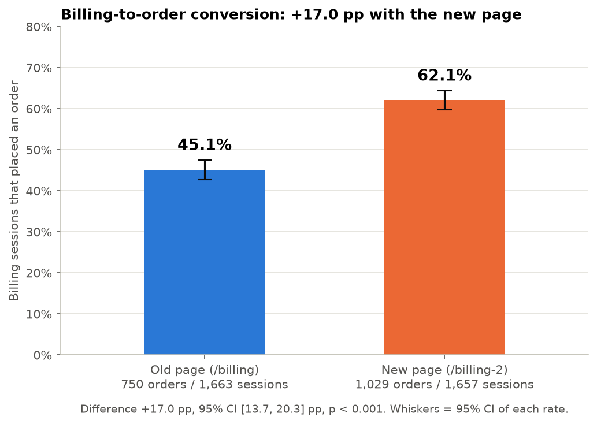
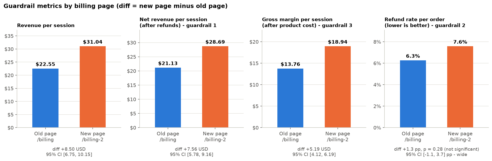
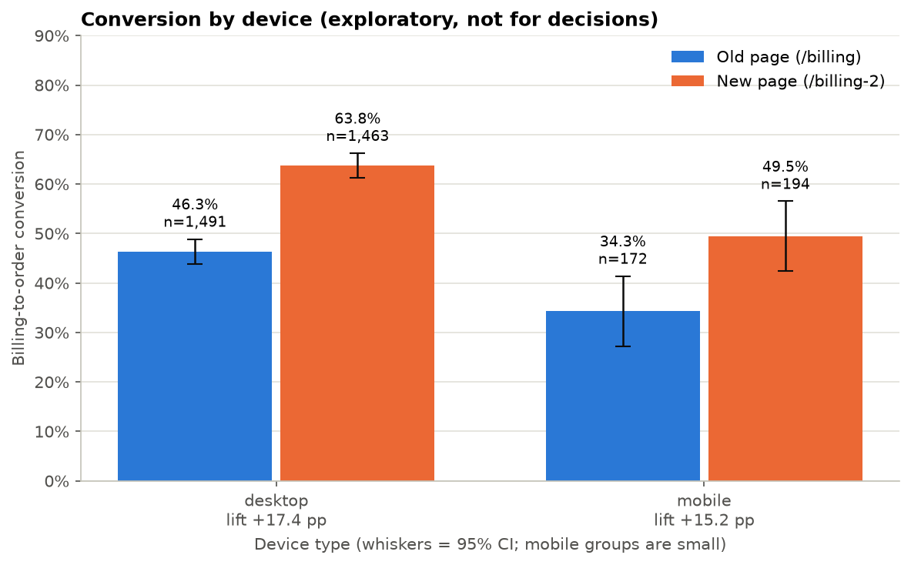
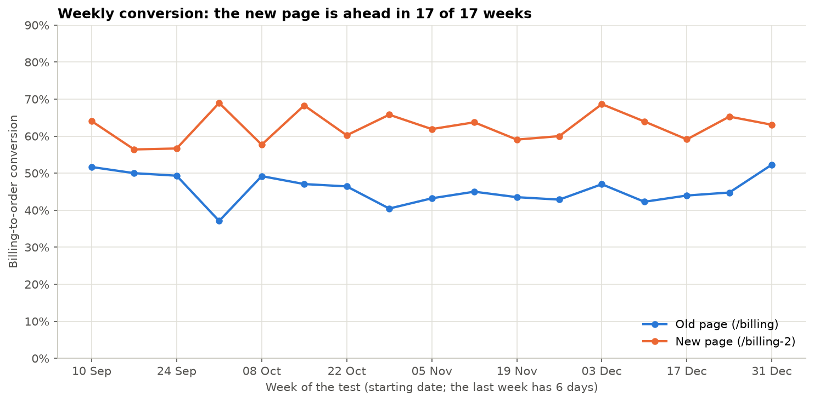
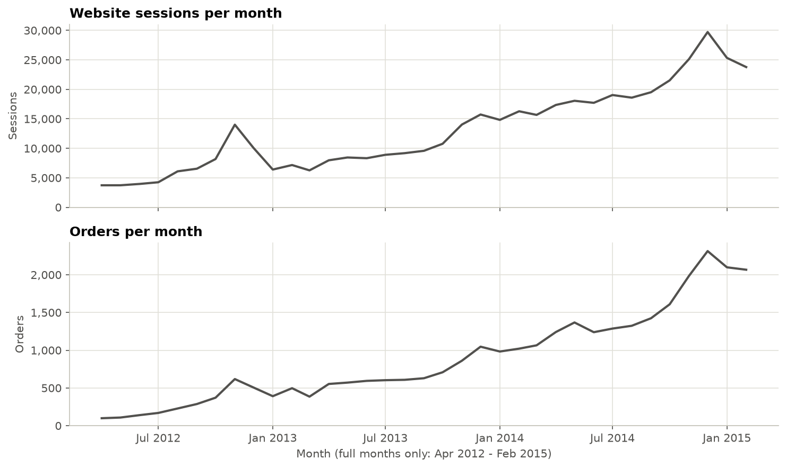
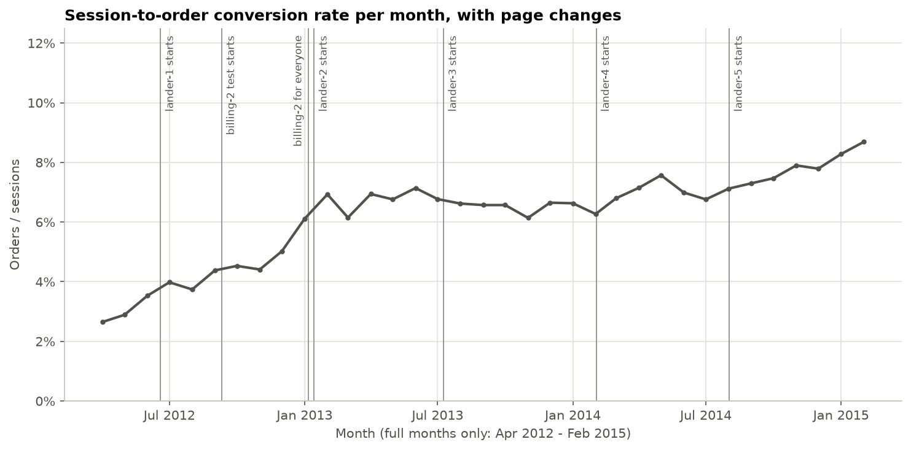
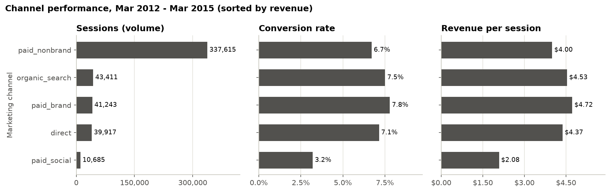
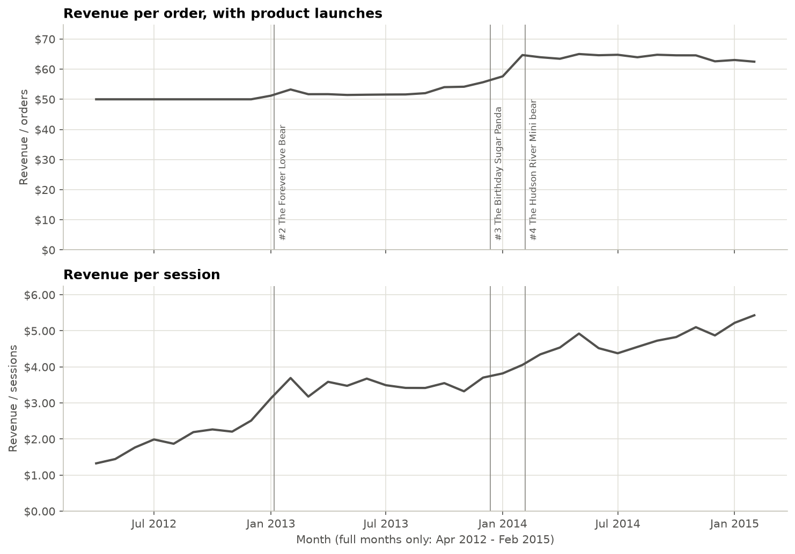

# Does the new billing page lift orders? An A/B test of a checkout page

An end-to-end A/B test analysis in **SQL + Python** for an online toy store: experiment validity checks, a hypothesis test with confidence intervals, guardrail metrics and a ship / don't-ship decision. The data is **synthetic** (Maven Fuzzy Factory, built by Maven Analytics for teaching).

## TL;DR

**Decision: SHIP /billing-2** (the new billing page).

| | Old page `/billing` | New page `/billing-2` | Difference |
|---|---|---|---|
| Billing-to-order conversion | 45.1% | 62.1% | **+17.0 pp** (95% CI 13.7 to 20.3, p < 0.001) |
| Revenue per billing session | $22.55 | $31.04 | **+$8.50** (95% CI 6.75 to 10.15) |
| Net revenue per billing session (after refunds) | $21.13 | $28.69 | **+$7.56** (95% CI 5.78 to 9.16) |

3,320 billing sessions over 17 weeks. The traffic split and group balance checks pass, and the new page was ahead in 17 of 17 weeks. The one open point: the refund rate was slightly higher with the new page (not statistically significant, but the interval is wide).

## Business question

Maven Fuzzy Factory sells teddy bears online. The checkout team built a new billing page, `/billing-2`, and showed it to about half of the visitors who reached the billing step, while the other half kept the old page, `/billing`.

**Does `/billing-2` increase the share of billing-page visitors who place an order, without hurting revenue, margin or refunds?**

Four context questions give the background (details in [Business overview](#business-overview)):

| Question | Finding |
|---|---|
| (a) What is the trend in sessions and orders? | Monthly sessions grew about 6.4x (3,734 to 23,778) and orders about 21x (99 to 2,067) between Apr 2012 and Feb 2015, with a spike every November-December. |
| (b) How has the session-to-order conversion rate trended? | It rose from 2.65% to 8.69%. The clearest step up is around January 2013, when three things changed at once. |
| (c) Which marketing channels are most successful? | Paid non-brand search is by far the biggest (71.4% of sessions). Paid brand search converts best (7.79%); paid social is the weakest (3.21%). |
| (d) How have revenue per order and per session evolved? | Revenue per order was a flat $49.99 with one product and reached about $62-65 with four products. Revenue per session grew from $1.33 to $5.43. |

## The result in two charts





## Data

- **Source:** Maven Fuzzy Factory from the [Maven Analytics Data Playground](https://mavenanalytics.io/data-playground). It is a **synthetic** e-commerce database (Mar 2012 - Mar 2015) made for teaching.
- **Tables:** `website_sessions` (472,871 rows), `website_pageviews` (1,188,124), `orders` (32,313), `order_items` (40,025), `order_item_refunds` (1,731), `products` (4). Column descriptions are in [docs/data_dictionary.csv](docs/data_dictionary.csv).
- **Not redistributed:** the CSV files are about 100 MB and are not in this repository. Download them from the link above and unzip them into `data/raw/` (see [data/raw/README.txt](data/raw/README.txt)).

## Method

**Experiment design**

- **Unit of analysis:** a session that reached a billing page. The variant is the billing page that session saw.
- **Test window:** derived from the data, not typed in. Start = the first ever `/billing-2` pageview (2012-09-10); end = the last ever `/billing` pageview (2013-01-05). Before this window the new page did not exist, and after it every visitor got the new page, so only inside the window were both pages live at the same time.
- **Outcome:** did the session place an order.

**Hypotheses** (written down before looking at the results; they are also in the header of [src/04_ab_test.py](src/04_ab_test.py))

- H0: conversion(`/billing-2`) = conversion(`/billing`)
- H1: the two conversion rates differ
- Two-proportion z-test, two-sided, alpha = 0.05

**Metrics**

- **Primary:** billing-to-order conversion rate = orders / billing sessions.
- **Guardrail 1:** net revenue per billing session = (revenue - refunds) / sessions. Must not fall.
- **Guardrail 2:** refund rate per order = refunded orders / orders. Must not be significantly worse.
- **Guardrail 3:** gross margin per session = (revenue - cost of goods) / sessions. Reported; should not fall.
- Average order value is **not** used: only one product ($49.99) existed during the test, so it is $49.99 in both groups and tells us nothing.

**Decision rule**

Ship `/billing-2` only if all of these hold: the validity checks pass, **and** the lift is statistically significant with the lower end of the 95% confidence interval above 0, **and** guardrails 1 and 2 are OK.

**Validity checks** (run before looking at the lift)

- **Sample ratio mismatch (SRM):** are the two groups about the same size, as a 50/50 split should give? Chi-square test; fails only if p < 0.001.
- **Balance:** do both groups have the same mix of device, marketing channel, new vs returning sessions and landing page? Chi-square test for each.
- **Contamination:** the split was per session, so a returning user could see both pages. Count those users and re-run the test without them.

**Statistics used:** two-proportion z-test (cross-checked with a chi-square test), normal-approximation confidence intervals for differences in rates, and bootstrap confidence intervals (2,000 resamples, seed 42) for per-session money metrics, which are not bell-shaped. The functions are in [src/stats_utils.py](src/stats_utils.py).

## Results

**Validity checks: all pass**

| Check | Result | Verdict |
|---|---|---|
| Sample ratio | 1,663 vs 1,657 sessions, p = 0.92 | Pass |
| Balance: device | p = 0.23 | Pass |
| Balance: channel | p = 0.70 | Pass |
| Balance: new vs returning session | p = 0.76 | Pass |
| Balance: landing page | p = 0.72 | Pass |
| Users who saw both pages | 18 users (38 sessions) | Result unchanged without them: 44.95% vs 62.09%, z = 9.84 |

**Primary result**

| | Old page `/billing` | New page `/billing-2` |
|---|---|---|
| Billing sessions | 1,663 | 1,657 |
| Orders | 750 | 1,029 |
| Conversion rate | 45.10% | 62.10% |

- Absolute lift: **+17.0 pp**; relative lift: +37.7%.
- 95% CI for the difference: 13.7 to 20.3 pp (bootstrap check: 13.5 to 20.3 pp).
- z = 9.82, p < 0.001. H0 is rejected.
- **Power:** with about 1,660 sessions per group, the test could detect a lift of about 4.8 pp (alpha 0.05, power 80%). The observed 17 pp is far above that, so this was not a borderline call.
- **Business impact:** about 170 extra orders per 1,000 sessions that reach the billing page (95% CI 137 to 203). This is not extrapolated to yearly revenue.

**Guardrails**

| Metric | Old page | New page | Difference | Verdict |
|---|---|---|---|---|
| Revenue per session | $22.55 | $31.04 | +$8.50 (95% CI 6.75 to 10.15) | Rose |
| Net revenue per session (guardrail 1) | $21.13 | $28.69 | +$7.56 (95% CI 5.78 to 9.16) | OK |
| Refund rate per order (guardrail 2) | 6.3% (47 of 750) | 7.6% (78 of 1,029) | +1.3 pp (95% CI -1.1 to +3.7), p = 0.28 | OK, with a caveat |
| Gross margin per session (guardrail 3) | $13.76 | $18.94 | +$5.19 (95% CI 4.12 to 6.19) | OK |

The refund-rate difference is not statistically significant, but the interval is **wide**: the data cannot rule out a refund rate up to 3.7 pp higher. Net revenue per session already subtracts refunds and still rose clearly, which is why the decision stands.

**Segments (exploratory, not for decisions)**

| Device | Old page | New page | Lift |
|---|---|---|---|
| Desktop | 46.3% (n = 1,491) | 63.8% (n = 1,463) | +17.4 pp (95% CI 13.9 to 21.0) |
| Mobile | 34.3% (n = 172) | 49.5% (n = 194) | +15.2 pp (95% CI 5.2 to 25.2) |

Both devices improved. The mobile groups are small, so the mobile estimate is rough.



**Stability**

The new page was ahead in **17 of 17 weeks**, so there is no sign of a novelty effect that fades. Both pages ran side by side through the November-December peak, so the season affects both groups equally.



As an observational check (not a second experiment): `/billing` converted at 44.5% before the test (870 of 1,954 sessions) and `/billing-2` at 63.3% in the 56 days after the test (834 of 1,318 sessions). Both are close to the test result.

**Repeat purchase within 90 days (exploratory): inconclusive**

7 of 750 buyers (0.9%) with the old page and 10 of 1,029 (1.0%) with the new page ordered again within 90 days. Repeat purchases are rare in this data, so nothing can be concluded from this.

The full one-page write-up is in [reports/decision_memo.md](reports/decision_memo.md). Every number is in [results/ab_results.json](results/ab_results.json).

## Business overview

Short context for the test. Full text: [results/business_findings.md](results/business_findings.md). Monthly charts use full months only (Apr 2012 - Feb 2015).

**(a) Sessions and orders grew strongly and are seasonal.** Monthly sessions went from 3,734 to 23,778 and orders from 99 to 2,067. The busiest month was December 2014 (29,722 sessions, 2,314 orders).



**(b) Conversion rose from 2.65% to 8.69%.** The clearest step up is around January 2013 (5.02% in Dec 2012, 6.93% in Feb 2013). In that fortnight `/billing-2` went to all visitors, a second product launched and a new landing page started. A trend line cannot separate these causes, which is why the billing page needed a proper A/B test.



**(c) Paid non-brand search brings the volume; brand and organic bring the quality.** Paid non-brand has 71.4% of sessions and 69.6% of revenue. Paid brand converts best (7.79%, $4.72 per session), then organic search (7.51%, $4.53). Paid social is the weakest (3.21%, $2.08).



**(d) Revenue per order rose as products were added.** It was exactly $49.99 through 2012 (one product), $54.16 by Nov 2013 and about $64.67 from Feb 2014 with four products. Revenue per session grew from $1.33 to $5.43.



**Where the test sits:** 11.0% of all sessions reach a billing page and 6.8% order ([funnel chart](reports/charts/05_funnel.png)). Billing is the last step before an order, so a better billing page turns into orders directly.

## Limitations

- **The data is synthetic.** It was built by Maven Analytics for teaching. Real experiments are usually messier, and a lift this large would be unusual.
- **Only the billing step was tested** (billing -> order). The test says nothing about earlier steps of the funnel.
- **The refund effect is not settled.** The difference is not significant, but the 95% CI (-1.1 to +3.7 pp) is wide.
- **Repeat purchases are too rare to judge** (7 and 10 repeat buyers).
- **Mobile traffic was small** (366 mobile billing sessions), so the mobile result is rough.
- **The split was per session, not per user.** 18 users saw both pages; removing them does not change the result.
- **The before/after rollout comparison is observational**, not a second experiment. A second product and a new landing page launched in the same weeks.
- **How visitors were assigned is not recorded in the data.** The even split and the balance checks are consistent with random assignment, but they cannot prove it.

## How to run

Requires Python 3.9 or newer (tested with Python 3.14). Expected runtime: under 3 minutes.

```bash
python -m venv .venv
source .venv/bin/activate        # Windows: .venv\Scripts\activate
pip install -r requirements.txt
# put the Maven Fuzzy Factory CSV files in data/raw/  (see data/raw/README.txt)
python run_all.py
```

The run ends with `ALL CHECKS PASSED`. It rebuilds the SQLite database, all result files and all charts, and checks the row counts, the group sizes and the headline numbers on the way.

Note: Python cannot create a virtual environment inside a folder whose path contains a colon (`:`). If you see that error, move the project to a path without one.

## Skills demonstrated

- **SQL:** joins, CTEs, CASE, aggregation, subqueries (including a correlated EXISTS), a view, and a window of dates derived from the data.
- **Hypothesis testing:** two-proportion z-test, chi-square cross-check, minimum detectable effect.
- **Confidence intervals:** normal approximation for rates, bootstrap for per-session money metrics.
- **Experiment validity:** sample ratio mismatch, balance checks, contamination and a sensitivity run.
- **Guardrail metrics:** net revenue, refund rate and gross margin next to the primary metric.
- **Segmentation and stability:** device split and weekly trend, clearly labelled as exploratory.
- **Communication:** decision rules fixed before the results, a one-page decision memo, stated limitations.
